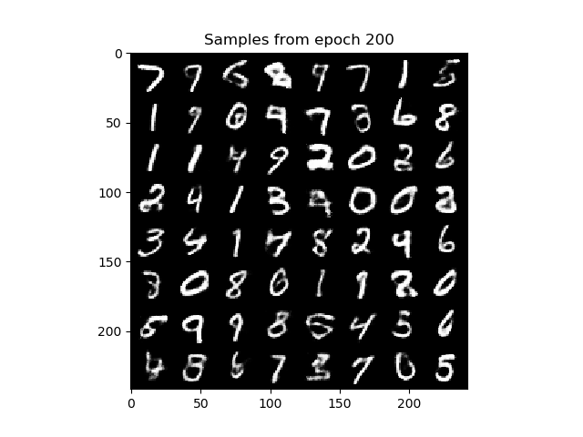
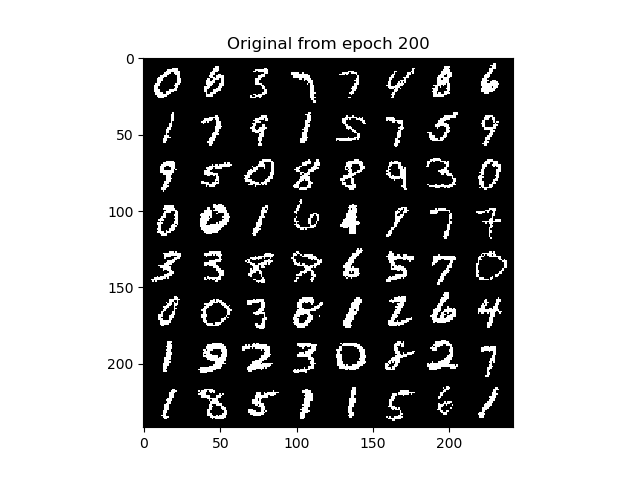
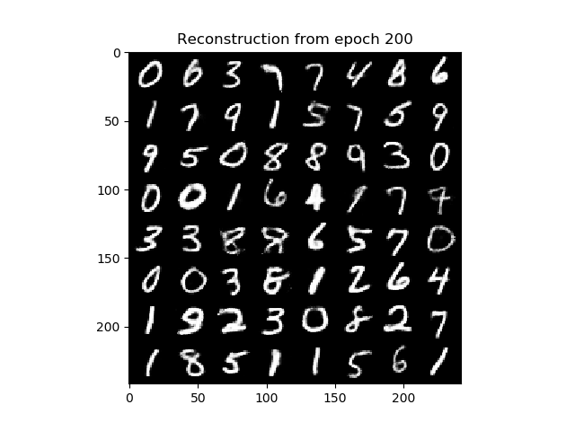

## Ladder Variational Autoencoders

Personal implementation of the paper *"Ladder variational autoencoders" by Sønderby, C. K., Raiko, T., Maaløe, L., Sønderby, 
S. K., & Winther, O. (2016)* (LVAE) in PyTorch. 
The main purpose of this repository is to make the paper implementation accessible and clear to people
that just started getting into Variational Autoencoders without having to look into highly optimized and difficult to 
search libraries.

I trained my model with the hyperparameters given in the original paper: we use 5 hierarchical layers with hidden units 512, 256, 128, 64, 32
respectively. The dimension of the latent space is 64, 32, 16, 8, 4 considering the layer from the upper one to the bottom one.
I trained the model only for 200 epochs. We compute the log-likelihood $p(x)$ on
the test set using 100 importance-weighted samples, adn we get -87.8755, that is far from 
convergence. 

### Samples from the prior p(z) after 200 epochs

### Reconstruction examples after 200 epochs

TODO: this is far from being a complete repo. There are some changes I am still want
make during my free time:
1. train until convergence using a GPU
2. create more functions to avoid repeated code
3. print more infos during training
4. using another dataset other than MNIST